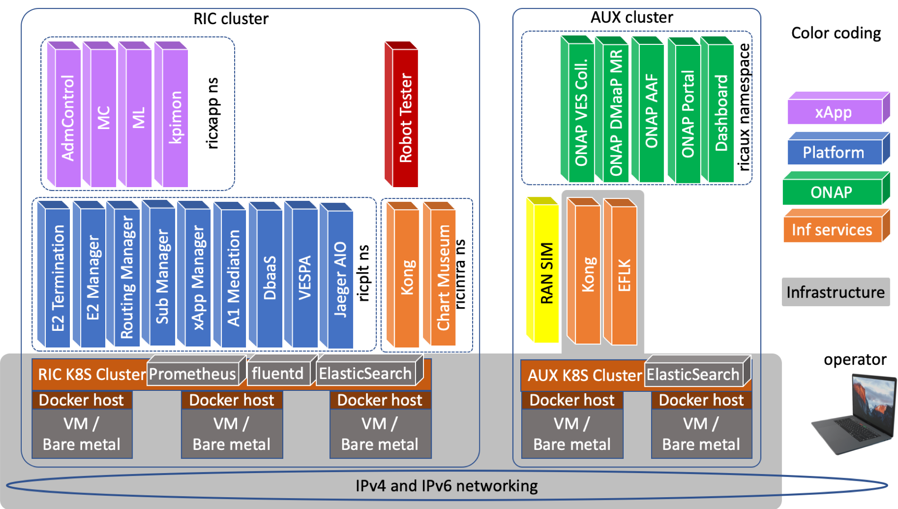
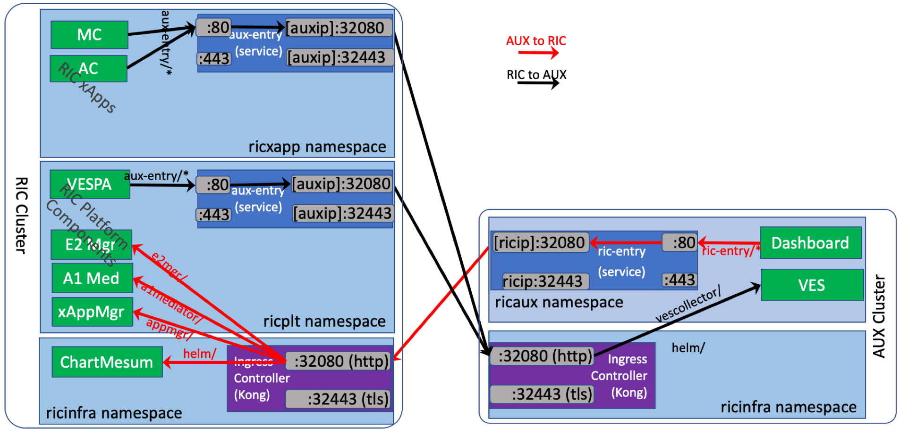

.. This work is licensed under a Creative Commons Attribution 4.0 International License.
.. SPDX-License-Identifier: CC-BY-4.0
.. ---------------LICENSE_START-------------------------------------------------------
.. Copyright (C) 2019-2020 AT&T Intellectual Property
.. -----------------------------------------------------------------------------------
.. This documentation file is distributed under the Creative Commons Attribution
.. 4.0 International License (the "License"); you may not use this file except in
.. compliance with the License.  You may obtain a copy of the License at
..
.. http://creativecommons.org/licenses/by/4.0
..
.. This file is distributed on an "AS IS" BASIS,
.. WITHOUT WARRANTIES OR CONDITIONS OF ANY KIND, either express or implied.
.. See the License for the specific language governing permissions and
.. limitations under the License.
.. ---------------LICENSE_END---------------------------------------------------------

Installing Near-realtime RIC
============================

The installation of Near Realtime RAN Intelligent Controller is spread onto two separate
Kubernetes clusters.  The first cluster is used for deploying the Near Realtime RIC (platform and
applications), and the other is for deploying other auxiliary functions.  They are referred to as
RIC cluster and AUX cluster respectively.

The following diagram depicts the installation architecture.

Within the RIC cluster, Kubernetes resources are deployed using three name spaces: ricinfra, ricplt,
and ricxapp by default.  Similarly, within the AUX cluster, Kubernetes resources are deployed using two name spaces:
ricinfra, and ricaux.

For each cluster, there is a Kong ingress controller that proxies incoming API calls into the cluster.
With Kong, service APIs provided by Kubernetes resources can be accessed at the cluster node IP and
port via a URL path.  For cross-cluster communication, in addition to Kong, each Kubernetes namespace
has a special Kubernetes service defined with an endpoint pointing to the other cluster's Kong. This
way any pod can access services exposed at the other cluster via the internal service hostname and port of
this special service.  The figure below illustrates the details of how Kong and external services work
together to realize cross-cluster communication.

Prerequisites
-------------

Both RIC and AUX clusters need to fulfill the following prerequisites.

- Kubernetes v.1.16.0 or above
- helm v2.12.3/v3.5.x or above
- Read-write access to directory /mnt

The following two sections show two example methods to create an environment for installing RIC.

VirtualBox VMs as Installation Hosts
^^^^^^^^^^^^^^^^^^^^^^^^^^^^^^^^^^^^

The deployment of Near Realtime RIC can be done on a wide range of hosts, including
bare metal servers, OpenStack VMs, and VirtualBox VMs.  This section provides detailed instructions
for setting up Oracle VirtualBox VMs to be used as installation hosts.

.. include:: ./ric/installation-virtualbox.rst

One-Node Kubernetes Cluster
^^^^^^^^^^^^^^^^^^^^^^^^^^^

This section describes how to set up a one-node Kubernetes cluster onto a VM installation host.

.. include:: ./ric/installation-k8s1node.rst

RIC Platform
-------------------------------------------

After the Kubernetes cluster is installed, the next step is to install the (Near Realtime) RIC Platform.

See instructions in ric-plt/ric-dep: https://docs.o-ran-sc.org/projects/o-ran-sc-ric-plt-ric-dep/en/latest/installation-guides.html

AUX Functionalities (Optional)
---------------------------------------------

.. include:: ./ric/installation-aux.rst

RIC Applications
---------------------------

See instructions in ric-plt/ric-dep: https://docs.o-ran-sc.org/projects/o-ran-sc-ric-plt-ric-dep/en/latest/installation-guides.html
