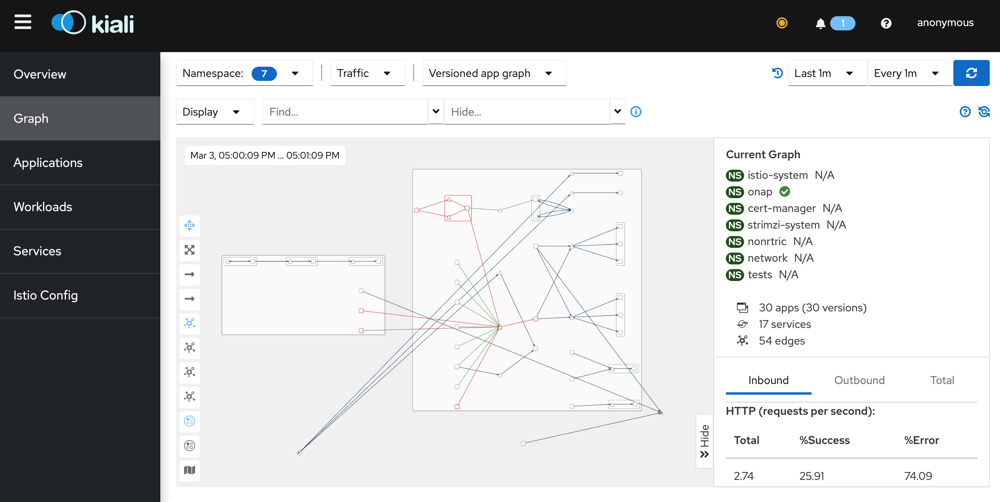

# Oran SMO + SM in a box


## Service mesh enabled Oran SMO installation on mikrok8s

Oran SMO + SM in a box provides environment to interact with Oran SMO installation with Istio service mesh enabled in all namespaces. This is intended as a POC showroom as well as testbed. It can be run on:

- Vagrant (Virtualbox backend enabled by default)
- AWS EC2
- your Ubuntu dedicated server
- your existing Kubernetes instance

It can quickly and effortlessly spin up and tear down when needed to run tests, CI or just look around and explore service mesh and SMO.

## Prerequisites

For setting the environment to deploy it to you will need either: [Vagrant](https://www.vagrantup.com/) and [Virtualbox](https://www.virtualbox.org/)

If you're running it from Ubuntu machine:

```
$ sudo apt install vagrant virtualbox
```

For other OS please consult the documentation for respective components.

For deploying in AWS EC2 instance, on local machine that you're starting deployment from you just need [Terraform](https://www.terraform.io/) and [awscli v2](https://docs.aws.amazon.com/cli/latest/userguide/getting-started-install.html).

Next you will need Ansible set up on machine that you will be running deployment from. It will deploy and configure Kubernetes (microk8s), Onap, Oran, Istio and various helper tools and dependencies. 

If you don't already have Ansible installed you can use Python's virtual environment to install it for your user. In chosen directory:

```
$ python3 -m venv venv
$ source venv/bin/activate
$ (venv) pip3 install ansible
$ (venv) pip3 install jmespath
```

Next install community general Ansible collection needed for Snap manipulation and Kubernetes core collection
 
```
$ (venv) ansible-galaxy collection install community.general
$ (venv) ansible-galaxy collection install kubernetes.core
```

Note that installing collections with ansible-galaxy is supported from version 2.9 onwards.


**Final requirement:** you will need **a lot** of RAM and CPU cores: 32 gigs of RAM and 16 CPU cores is not an exaggeration.
For Virtualbox those values can be adjusted in [Vagrantfile](oran_smo/Vagrantfile), for AWS in [variables.tf](terraform/variables.tf) (by choosing appropriate instance).

Onap part of that SMO consist of components:

- [aaf](https://wiki.onap.org/pages/viewpage.action?pageId=15991938)
- [dmaap](https://docs.onap.org/projects/onap-dmaap-datarouter/en/latest/)
- [dcae-ves-collector](https://docs.onap.org/projects/onap-dcaegen2/en/latest/sections/apis/ves.html)
- [policy framework](https://docs.onap.org/projects/onap-policy-parent/en/latest/architecture/architecture.html)
- [sdnc](https://docs.onap.org/projects/onap-sdnc-oam/en/latest/index.html)

with dependencies like Mariadb or Postgresql.

For Oran part besides Non-RealTime RIC there are also simulators and tests deployed.

## Variables file

[Variables file](oran_smo/vars/defaults.yml) has been populated with sample values and version matrix. Solution is being developed and tested on current master branch, but might (minus service mesh) be as well used to deploy older versions.
File is pretty self explanatory one note about os_user and os_group - those are user and group names under which software will be deployed, by default if you use Vagrant it will be overridden by Vagrantfile to vagrant:vagrant, for Terraform they are overridden to ubuntu:ubuntu, for your own server you can put whatever user you wish to use (user and group in that case must be created manually before running ansible)

```
# proxy settings
proxy_enabled: false
https_proxy: https_proxy=http://squid.internal:3128
http_proxy: http_proxy=http://squid.internal:3128
no_proxy: no_proxy=10.1.0.0/16,10.152.183.0/24,127.0.0.1

os_user: "ubuntu"
os_group: "ubuntu"

#Onap requirements matrix
#|Release | Kubernetes | Helm  | kubectl | Docker  | Cert-Manager | Strimzi
#|Jakarta | 1.22.4     | 3.6.3 | 1.22.4  | 20.10.x | 1.8.0        | 0.28.0
#|Kohn    | 1.23.8     | 3.8.2 | 1.23.8  | 20.10.x | 1.8.0        | 0.32.0

microk8s_version: 1.23/stable
helm_version: 3.8.2
kubectl_version: 1.23/stable
docker_version: latest/stable
istio_version: 1.17.0
strimzi_version: 0.32.0
certmanager_version: v1.8.0
k9s_version: v0.27.3

# Jakarta 7e4cced6c92ffdbc480eb843592b0e500b350721
# Kohn

onap_version: "master"
oran_version: "master"

chartmuseum_port: "8080"


```

## Deployment

### Vagrant

Once you'll get your env set up (have Vagrant, VirtualBox, Ansible + collections installed), run deployment by simply issuing command:

```
$ cd oran_smo
$ vagrant up

```

This will take a long time depending on your hardware specs, be prepared for 30 minutes or more.

### AWS EC2

That is by far the fastest and most performant way to deploy the whole thing, but also can be quite costly as it spawns m6i.12xlarge instance, please make sure you're keeping track of its lifecycle.

Check your AWS connectivity and access with awscli:
```
$ aws sts get-caller-identity
```

it should return something similar to:

```
{
    "UserId": "AIDAVC4R6WB324GRHH11",
    "Account": "312349061234",
    "Arn": "arn:aws:iam::312349061234:user/whoami"
}
```
Create SSH keypair in PEM format named **oran_smo.pem**, for example for us-east-1 under:
https://us-east-1.console.aws.amazon.com/ec2/home?region=us-east-1#KeyPairs:

By default Terraform will look for it in:

```
$HOME/.ssh/oran_smo.pem
```
on machine you're issuing Terraform commands from.

Location of that file can be adjusted in [variables.tf file](terraform/variables.tf)

**Notice:** Terraform will among any other components create security groups for Kiali dashboard access on port 20001 and SSH access. Those will be wide open to the world and it's advisable to restrict access to them by changing 

```
cidr_blocks = ["0.0.0.0/0"]
```
to your IP address in [main.tf](terraform/main.tf) file.

Initialize terraform, this will download AWS provider plugins

```
$ cd terraform
$ terraform init
```
Once done run
```
$ terraform plan
```
To see what will be created/changed. If it looks good, you can apply the plan to your infrastructure with:

```
$ terraform apply
```
That will take something around 20 minutes.

Once you don't need it, tear it down with:
```
$ terraform destroy
```

### Your own server

You can deploy it on your own server running Ubuntu 20.04 by using Ansible playbooks directly on it.

You can run it directly on that server:
```
$ ansible-playbook -e os_user=your_username -e os_group=your_user_group -i hosts.ini deploy_mk8s.yaml
$ ansible-playbook -e os_user=your_username -e os_group=your_user_group -i hosts.ini deploy_oran_smo.yaml
```
or remotely by changing host in [hosts.ini](oran_smo/hosts.ini) file.

### Your Kubernetes instance

Using deploy_oran_smo.yaml you can deploy it to your own Kubernetes instance:

```
$ ansible-playbook -e os_user=your_username -e os_group=your_user_group -i hosts.ini deploy_oran_smo.yaml
```

That's assuming you have your kube config in place and working. 

## The result

After the deployment is finished you can ssh into the box in usual manner:

### Vagrant

```
$ vagrant ssh
```

alternatively you can use ssh command

```
$ ssh -p2222 vagrant@localhost
```

default password is "vagrant"

### AWS EC2

Use your PEM keypair file to ssh to your AWS EC2 instance:

```
$ ssh -i $HOME/.ssh/oran_smo.pem ubuntu@your_instance_ip_address
```

To check what's going on in cluster you can use kubectl or CLI UI [k9s](https://github.com/derailed/k9s) which is installed by Ansible script.

To interact with Istio dashboard run inside host:

```
$ istioctl dashboard kiali --address 0.0.0.0 --port 20001
```

this will start Kiali on http://your_instance_ip_address:20001/kiali/

At the end of Terraform run you will get information based on your instance IP address:

```
...
Outputs:

url-kiali = "http://123.123.123.123:20001"
```
to easier find Kiali address and port.

There's port forward configured in Vagrantfile so you can use it from your host machine to reach Kiali dashboard.



## Simulators

Simulators by default are not run during deployment process, in Ansible playbook they are tagged with 'simulators' tag so you can run them by issuing SMO deployment playbook once again but with --tags=simulators switch.

```
$ ansible-playbook -e os_user=your_username -e os_group=your_user_group -i hosts.ini deploy_oran_smo.yaml --tags=simulators
```


## Tests

Tests by default are not run during deployment process, in Ansible playbook they are tagged with 'tests' tag so you can run them by issuing SMO deployment playbook once again but with --tags=tests switch.

```
$ ansible-playbook -e os_user=your_username -e os_group=your_user_group -i hosts.ini deploy_oran_smo.yaml --tags=tests
```
Results will be in tests pod logs.


## License

Copyright 2023 Samsung Electronics Co., Ltd.

Licensed under the Apache License, Version 2.0 (the "License");
you may not use this file except in compliance with the License.
You may obtain a copy of the License at

     http://www.apache.org/licenses/LICENSE-2.0

Unless required by applicable law or agreed to in writing, software
distributed under the License is distributed on an "AS IS" BASIS,
WITHOUT WARRANTIES OR CONDITIONS OF ANY KIND, either express or implied.
See the License for the specific language governing permissions and
limitations under the License.


